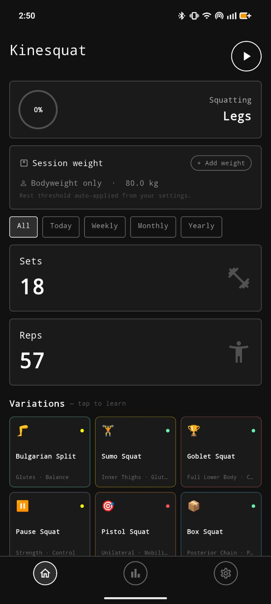
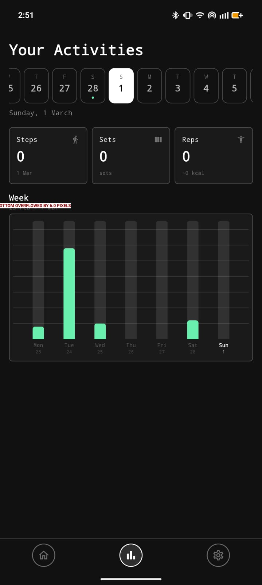
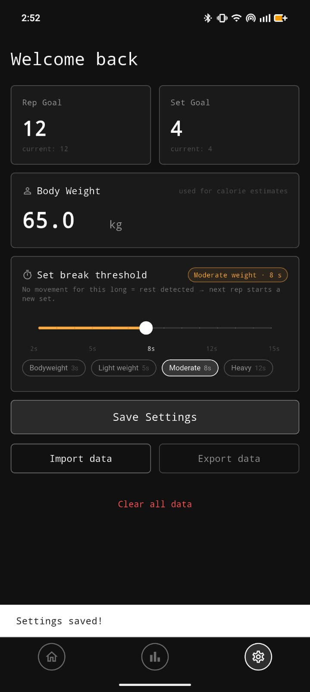

# Kinesquat 🏋️

A Flutter-based Android app that automatically tracks your squats using your phone's **accelerometer** — no camera, no internet, no manual input. Just squat and let Kinesquat count.

---

## 📸 Screenshots

| Home | Activities | Settings |
|------|-----------|----------|
|  |  |  |

---

## ✨ Features

### 🔢 Automatic Rep & Set Counting
Kinesquat uses the device accelerometer to detect squat movements in real time. No buttons to press — just do your reps and the app counts for you.

### ⏱️ Smart Set Detection via Break Threshold
Configure a **rest threshold** (in seconds). If no squat movement is detected within that window, the next rep is automatically placed into a new set. Presets are available for different training styles:

| Preset | Threshold |
|--------|-----------|
| Bodyweight | 3s |
| Light weight | 5s |
| Moderate weight | 8s |
| Heavy weight | 12s |

### 🔥 Calorie Tracking
Enter your **body weight** and any **additional weight** being used (e.g. barbell, dumbbells). Kinesquat estimates calories burned per session using this data.

### 🚶 Pedometer
The app also tracks your **daily step count** alongside your squat sessions, giving you a fuller picture of your physical activity.

### 📊 Activity Dashboard
A scrollable **date selector** lets you browse any day's activity. Each day shows:
- Steps taken
- Number of sets completed
- Total reps and estimated calories

A **weekly bar chart** visualises your squat volume day-by-day so you can spot trends at a glance.

### 🏃 Squat Variations Library
Six built-in squat variations, each with step-by-step setup instructions, targeted muscle groups, and coaching tips:

| Variation | Focus |
|-----------|-------|
| Bulgarian Split Squat | Glutes · Balance |
| Sumo Squat | Inner Thighs · Glutes |
| Goblet Squat | Full Lower Body |
| Pause Squat | Strength · Control |
| Pistol Squat | Unilateral · Mobility |
| Box Squat | Posterior Chain |

Tap any variation to read through its guided setup cards.

### 📤 Import & Export Data
Kinesquat is fully **offline**. Your data stays on your device, but you can back it up or transfer it between devices using the **Export / Import** feature.

---

## 🛠️ Tech Stack

- **Framework:** Flutter (Dart)
- **Platform:** Android
- **Sensors:** Device accelerometer (rep detection), pedometer (step counting)
- **Storage:** Local / offline — no backend or account required

---

## 🚀 Getting Started

### Prerequisites

- [Flutter SDK](https://docs.flutter.dev/get-started/install) (stable channel)
- Android device or emulator (API 21+)
- A physical device is strongly recommended for accurate accelerometer readings

### Installation

```bash
# Clone the repository
git clone https://github.com/Priyansh956/kinesquat.git

cd kinesquat

# Install dependencies
flutter pub get

# Run on a connected Android device
flutter run
```

### Build APK

```bash
flutter build apk --release
```

The APK will be generated at `build/app/outputs/flutter-apk/app-release.apk`.

---

## ⚙️ Configuration

All settings are available inside the **Settings** screen (gear icon):

| Setting | Description |
|---------|-------------|
| Rep Goal | Target reps per set |
| Set Goal | Target number of sets per session |
| Body Weight | Used for calorie estimation |
| Set Break Threshold | Inactivity duration that separates one set from the next |

Settings are saved locally and persist across sessions.

---

## 📁 Project Structure

```
kinesquat/
├── lib/              # Dart source code
├── android/          # Android-specific configuration
├── ios/              # iOS project files (not actively maintained)
├── images/           # App screenshots
├── test/             # Unit and widget tests
├── pubspec.yaml      # Dependencies and metadata
└── README.md
```

---

## 🤝 Contributing

Contributions, issues, and feature requests are welcome! Feel free to open an issue or submit a pull request.

1. Fork the repository
2. Create a feature branch: `git checkout -b feature/your-feature`
3. Commit your changes: `git commit -m 'Add your feature'`
4. Push to the branch: `git push origin feature/your-feature`
5. Open a Pull Request

---

## 📄 License

This project is open source. See the [LICENSE](LICENSE) file for details.

---

> Built with Flutter 💙 — No gym membership required to contribute.
